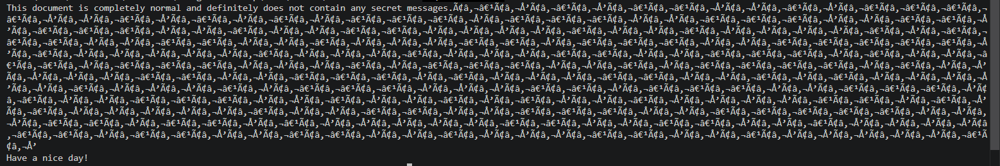

# Invisible Ink — Writeup

**Category    :** Forensics  
**Difficulty  :** Medium  
**File        :** invisible_ink.txt   
**Description :**

Can you read between the lines?

## Solve

Jika file dibuka maka terdapat karakter aneh



Saat karakter itu dicek, hasilnya menunjukkan hanya ada empat codepoint yang berulang

- `â` (`0xe2`)
- `€` (`0x20ac`)
- `‹` (`0x2039`)
- `Œ` (`0x152`)

Kalau dilihat per grup, pola yang muncul hanya dua token berulang

- `​`
- `‌`

Ini kemungkinan bahwa sebenarnya hanya ada dua simbol, artinya sangat cocok dipetakan menjadi

- satu simbol = `0`
- satu simbol = `1`

 Karena hanya ada dua token unik, yang akan ku coba adalah menganggap chall ini menyimpan data biner. Asumsi kemungkinan mapping nya

- `​ = 0`, `‌ = 1`
- `​ = 1`, `‌ = 0`

Lalu bit itu dibagi per 8 bit untuk diubah menjadi byte ASCII. Kenapa aku pilih per 8 bit, karna flag biasanya berupa teks `ASCII biasa`, sehingga cara paling natural adalah membaca hasil biner sebagai deretan byte. Setelah jumlah token dihitung, totalnya adalah `296 token` karna `296 / 8 = 37`. Maka jumlah ini sesuai untuk diubah menjadi 37 byte `ASCII`. maka asumsi awal ku benar kalau itu adalah biner. Maka ku coba buat solver nya dan karna `'ââ'` adalah ciri khas dari `UTF-8` maka solver akan membaca sebagai encoding `UTF-8`

solve.py
```
from pathlib import Path
import re

path = Path('invisible_ink.txt')
text = path.read_text(encoding="utf-8")
block = re.search(r'messages\.(.+?)\nHave a nice day!', text, re.S).group(1)

tokens = [''.join(block[i:i+3]) for i in range(0, len(block), 3)]
unique = sorted(set(tokens))
mapping = {unique[0]: '1', unique[1]: '0'}
bits = ''.join(mapping[token] for token in tokens)
flag = bytes(int(bits[i:i+8], 2) for i in range(0, len(bits), 8)).decode()

print('Unique tokens:', unique)
print('Bit mapping:', {repr(k): v for k, v in mapping.items()})
print('Token count:', len(tokens))
print('Bits:', bits)
print('Flag:', flag)
```

output
```
Unique tokens: ['‌', '​']
Bit mapping: {"'‌'": '1', "'​'": '0'}
Token count: 296
Bits: 01010011010000110101010001000110001100100011011001111011011110100011001101110010001100000101111101110111001100010110010001110100011010000101111100110001011100110101111101110100011100100011000101100011011010110111100101011111011001100011000001110010010111110011001101111001001100110111001101111101
Flag: SCTF26{z3r0_w1dth_1s_tr1cky_f0r_3y3s}
```

## Flag

```text
Flag: SCTF26{z3r0_w1dth_1s_tr1cky_f0r_3y3s}
```
