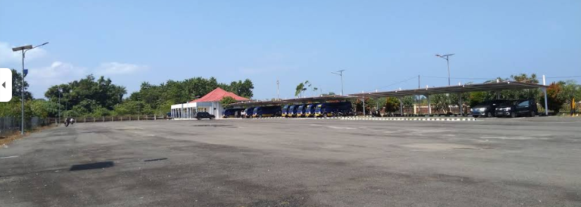

# Airport — Writeup

**Category    :** OSINT  
**Difficulty  :** Medium  
**Target      :** https://airport.sctf.my.id/  
**File        :**   
**Description :**

dibilang ini parkiran tpi bukan, ini bandara!
bisahkah kamu menemukan ini bandara mana?

## Solve

Kalau di klik asal akan ada seperti ini `❌ Titik belum pas! Coba perhatikan lagi clue fotonya. (Jarak error: 1204435 meter)`. Dari itu kita menjadi tau jika terdapat berapa jarak/meter dari coor yang asli, setelah itu tinggal kita klik sampai jarak/meter nya berkurang terus dan sampai mendapat di lokasi pastinya yaitu di `Bandar Udara Muhammad Taufiq Kiemas` dengan coor `-5.211781, 103.941146`. Lalu akan keluar flagnya 

## Flag

```text
SCTF26{w3lc0m3_t0_l4mpung_0s1nt_m4st3r}
```
