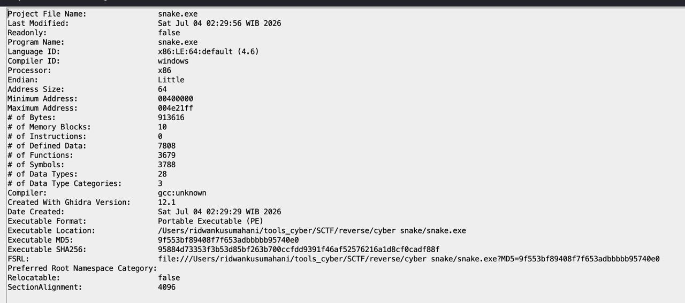
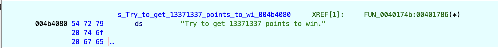
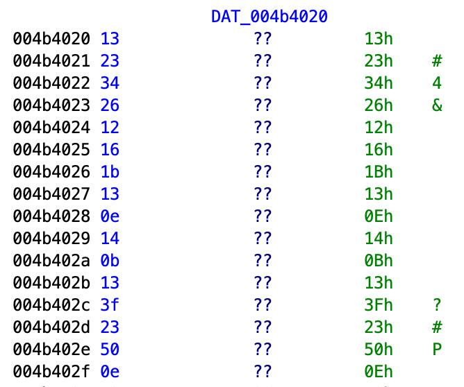
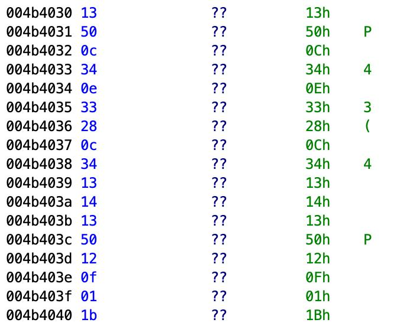

# Cyber Snake — Writeup

**Category    :** Reverse  
**Difficulty  :** Medium  
**File        :** snake.zip   
**Description :**

A simple console game. You need a score of 13371337 to unlock the flag.

## Solve

Dari deskripsi soal kita diharuskan main game ini dan berhasil mencapai score `13371337`, maka program akan membuka flag. Tapi karena score segitu sangat besar dan tidak realistis untuk dicapai manual, kita langsung coba reverse binary-nya.

Pertama aku coba `unzip` dahulu lalu pakai `file` untuk melihat jenis file nya

```
unzip snake.zip
file snake.exe
```

output
```
snake.exe: PE32+ executable (console) x86-64 (stripped to external PDB), for MS Windows
```

Lalu kita coba cek dengan `ghidra` karna itu adalah file `executable`, kita coba import ke dalam ghidra



Selanjutnya kita ke `Window` dan pilih `Defined Strings`, lalu kita cari flag, score, dan 1337



Di fungsi tersebut, kita mencari pengecekan score. Karena target score adalah 13371337, kita convert ke hexadecimal

```
print(hex(13371337))
```

output
```
0xcc07c9
```

Setelah itu kita cari string `Try to get 13371337 points to win.` di Defined Strings, aku mengikuti XREF-nya ke fungsi FUN_0040174b. Fungsi ini ternyata berisi logic utama game Cyber Snake.

```
undefined8 FUN_0040174b(void)

{
  longlong *plVar1;
  int local_14;
  int local_10;
  int local_c;
  
  FUN_0040af60();
  FUN_00418920(&local_10);
  plVar1 = FUN_004ac780(&DAT_004b3960,"Welcome to Cyber Snake!");
  FUN_0046d7d0(plVar1,FUN_004a9f30);
  plVar1 = FUN_004ac780(&DAT_004b3960,"Try to get 13371337 points to win.");
  FUN_0046d7d0(plVar1,FUN_004a9f30);
  while ((0 < local_c && (local_10 < 0xcc07c9))) {
    plVar1 = FUN_004ac780(&DAT_004b3960,"1. Eat apple (10 points)");
    FUN_0046d7d0(plVar1,FUN_004a9f30);
    plVar1 = FUN_004ac780(&DAT_004b3960,"2. Hit wall (-10 health)");
    FUN_0046d7d0(plVar1,FUN_004a9f30);
    plVar1 = FUN_004ac780(&DAT_004b3960,"3. Exit");
    FUN_0046d7d0(plVar1,FUN_004a9f30);
    FUN_004ac780(&DAT_004b3960,"Action: ");
    FUN_0046b5c0(&DAT_004b3600,&local_14);
    if (local_14 == 1) {
      local_10 = local_10 + 10;
    }
    else {
      if (local_14 != 2) break;
      local_c = local_c + -10;
    }
    FUN_00401540(&local_10);
  }
  plVar1 = FUN_004ac780(&DAT_004b3960,"Game Over!");
  FUN_0046d7d0(plVar1,FUN_004a9f30);
  return 0;
}
```

Pada potongan logic ini `while ((0 < local_c) && (local_10 < 0xcc07c9))` terdapat hexadecimal `0xcc07c9` jika di convert akan menjadi `13371337`, Lalu lanjut bagian bytes di sekitar branch `berhasil`, kita menemukan bytes mencurigakan di section `.rdata`, tepat setelah string `You beat the impossible game!`, Bytes nya adalah

```
13 23 34 26 12 16 1b 13 0e 14 0b 13 3f 23 50 0e
13 50 0c 34 0e 33 28 0c 34 13 14 13 50 12 0f 01 1b
```




Bytes ini bukan ASCII normal, jadi kemungkinan flag yang terenkripsi. maka ku coba buat solver nya

dec.py
```
def main():
    encrypted_hex = (
        "1323342612161b130e140b133f23500e"
        "13500c340e33280c3413141350120f011b"
    )
    encrypted = bytes.fromhex(encrypted_hex)
    decrypted = bytes()
    for b in encrypted:
        decrypted += bytes([b ^ 0x60])
    print("Raw decrypted flag:")
    print(decrypted.decode(errors="replace"))
    inner = decrypted.decode(errors="replace")
    flag_content = inner.split("{", 1)[1].rstrip("{")
    final_flag = f"SCTF26{{{flag_content}}}"
    print("Final flag:")
    print(final_flag)
if __name__ == "__main__":
    main()
```

output
```
Raw decrypted flag:
sCTFrv{sntks_C0ns0lTnSHlTsts0roa{
Final flag:
SCTF26{sntks_C0ns0lTnSHlTsts0roa}
```

## Flag

```text
SCTF26{sntks_C0ns0lTnSHlTsts0roa}
```
